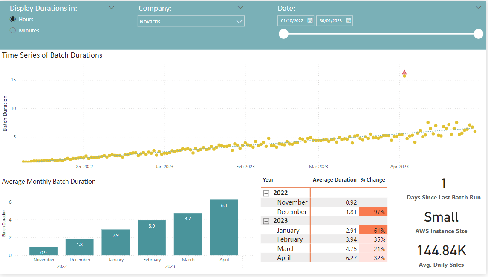
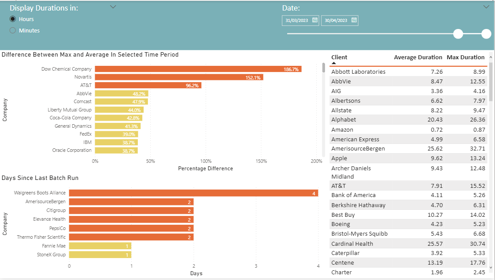

# Batch Duration Monitoring

This project is largely based on a PowerBi report that I built in my current role. The PowerBI report allows the client support team to monitor and investigate the batch processes that are vital to the success of the company.


## Narrative

FakeCompany Plc is an SaaS B2B company that provides ground-breaking analysis of their client's sales data to help guide the client's business decisions and ultimately drive success.

Each day, clients send sales data in csv format to FakeCompany Plc, containing information about every sale/transaction that they made the day prior (e.g Transaction Date, Product, Amount etc). FakeCompany Plc first normalize and then analyse the data in a batch process. The resulting output is a detailed report which is sent to the clients, containing the analysis as well as recommendations based on the analysis.

These batch processes are critical to the success of FakeCompany Plc. FakeCompany Plc's clients pay a large annual subscription therefore expect reports to be delivered on time each day. Any failures or delays can cause extreme discontent and may harm client relationships. As such, it is important that FakeCompany Plc monitor batch run times to find and resolve any problems before they impact clients.

Data for each batch run (Client, Batch Run Date, Duration) is stored in an SQL database which is connected to the PowerBI report shown below. The report allows the client support team to monitor in real-time and locate and react to any issues ASAP.

## Tools and Libraries Used

- Webscraping was done using Python (Pandas)
- Data generation and manipulation was done using Python (Pandas, Numpy)
- Reporting / Dashboarding was done using PowerBI and DAX

## The PowerBI Report 

The report consists of 2 pages:

### 1. Client Investigation



This Page allows users to view the batch duration information of a selected client within a selected date range.

**Features:**

- Date slider to select specific date ranges
- Option to switch between hour or minute measurements of batch durations
- Potential outlier durations highlighted by red triangles
  - Easy for client support team to spot which batch runs should be investigated
- Percentage change of average batch duration MoM
- Tiles showing information specific to the client
  - Time since latest batch run, AWS Instance Size, Average Daily Sales

### 2. Monitoring



**Features:**

- Shows clients who have had recent batch runs much longer than the recent average run time.
  - Indicating extremely large batch runs that should be investigated
- Graph to show clients with more than 1 day since their most recent batch run
  - Indicating recent failed batches that need to be investigated by the support team

  ## Generating the data

Firstly, I needed to generate a list of fake clients for FakeCompany Plc. I did this by using the Python script ```scraper.py``` to scrape a list of the top 100 companies in the US from this Wikipedia article: [https://en.wikipedia.org/wiki/List\_of\_largest\_companies\_in\_the\_United\_States\_by\_revenue](https://en.wikipedia.org/wiki/List_of_largest_companies_in_the_United_States_by_revenue) .

For each company in the list,

Then, I calculated average

**1. The number of daily sales to be processed.**

- The more sales data that needs to be processed, the longer the batch run time.

**2. The size of the AWS instance.**

- Larger, more powerful AWS instances drastically decrease batch run time.

**3. The time since the first batch run**

- Summaries of each batch run are saved and re-processed in subsequent batch runs to analyse new data against old data. As time goes on, the amount of historical data that needs to be re-processed grows, which increases the batch run time.


Each client is assigned a random 'start date' for their first ever batch between 2022-10-01 and 2023-02-01

The daily batch durations are then generated for each client using the initial batch duration combined with a randomly selected mathematical function from ```increasing_functions.py```. These functions simulate the natural increase over time of the batch run duration (**point 3** above).


## Usage

- Install requirements using ```pip install -r requirements.txt```
  - Ensure you use Python 3
- Run ```scraper.py```
  - This will scrape and download the company data from Wikipedia
- Run ```generate_data.py```
  - This will generate the fake batch data for the report
- Read the generated```02_intermediate.csv``` and ```03_final.csv``` into the PowerBI report ```Batch_Durations_Report.pbix``` by changing the source path

## Future Improvements

- Making the generated data more 'realistic'
  - Add 'Succeeded' and 'Failed' status to each batch run to highlight failed batches
  - Improve mathematical functions to increase the batch durations over time
